<h1 align="center">
  
</h1>

  made with love at dojo.KineticMatrix.io 🥷🧡⛩️

Welcome to **App Building with Swift: Your Beginner's Guide**! This repository is your gateway to unleashing your inner app wizard. It's packed with resources from the course hosted on [dojo.kineticmatrix.io](https://dojo.kineticmatrix.io). Whether you’re a tech newbie or a coding ninja in the making, this is where the magic begins.

---

### ⛩️ About the Course

Ever dreamed of creating an app but didn’t know where to start? Well, dream no more! In this course, we’re diving headfirst into Swift—a programming language so sleek and intuitive, it’ll have you casting coding spells in no time. This isn’t just about writing code; it’s about building bridges to your app-development ambitions. By the end, you’ll be wielding the skills to create iOS apps that are as innovative as they are smooth. Who knows? Maybe your app will be the next big thing on the App Store!

---

### 👋 How to Reach Me

Have burning questions or just want to geek out about Swift? Join our **Discord community** and connect with fellow learners on their app-building journeys. This invite link to [Kinetic Matrix Discord](https://discord.gg/3U4xmcmhr2) will teleport you straight there. Let’s learn and grow together!

---

### 🥷 Connect with Me on Social Media

Keep up with my latest updates, app-building hacks, and maybe a ninja emoji or two:
- [Twitter/X](https://x.com/itsmarcosjreyes)
- [Instagram](https://www.instagram.com/itsmarcosjreyes/)
- [TikTok](https://www.tiktok.com/@itsmarcosjreyes)

---

### 🌊 What You’ll Learn

- **The Swift Basics**: Learn how to be a cool nerd—master variables, constants, data types, and expressions. It’s your foundation for greatness.
- **The Secret Language of Pseudo Code**: Discover how to turn magical ideas into Swift reality.
- **Xcode Demystified**: Navigate Xcode Playgrounds like a pro and explore how your app transforms from a simple idea to a polished product.
- **Control Flow and Functions**: From conditionals to loops, learn how to make your code smarter and your app smoother.
- **Collections**: Conquer strings, arrays, dictionaries, and more. (Collection Conundrums might move, but the fun stays!)
- **Building Custom Types**: Create structures, classes, and enums like a seasoned developer.
- **Advanced Concepts Made Simple**: Protocols, closures, and generics—oh my! You’ll peek behind the curtain at some advanced Swift magic.
- **Memory Management and ARC**: Keep your app efficient and crash-free.
- **The Grand Finale**: Build your very own sample app and prepare to share it with the world!

---

### 🚀 Get Started

Download this repository to access all the goodies you need to follow along with the course. Keep an eye out for updates, pro tips, and extra content as you advance.

---

### 🥷 The Ninja Developer's Journey: From Code Novice to Anime-Level Awesomeness

```mermaid
sequenceDiagram
  participant Student as Aspiring Ninja Dev
  participant KineticMatrix as KineticMatrix
  participant Idea as Anime Spark
  participant DreamLife as Dream Life

  Student->>KineticMatrix: "Teach me Swift, Sensei!"
  KineticMatrix-->>Student: "Patience, young padawan. Let’s summon the code scrolls."

  Student->>KineticMatrix: "Classes? Enums? This feels like a boss battle!"
  KineticMatrix-->>Student: "You’re leveling up! Soon, you’ll unlock ultimate jutsu."

  Student->>Idea: "What if I made an app to track anime power levels?"
  Idea-->>Student: "Yes! 'PowerMeter 9000'—it’s genius!"

  Student->>KineticMatrix: "Sensei, will this even work?"
  KineticMatrix-->>Student: "Believe in your jutsu. Remember, 'debug' is the ninja way."

  Student->>Idea: "It works! My app is alive!"
  Idea-->>Student: "You’ve awakened your creative powers. Keep going!"

  Student->>DreamLife: "I made it!"
  DreamLife-->>Student: "Welcome, ninja developer. This is just your first arc."
```

### Key Notes:
1. **Master your coding jutsu**: Start small, keep practicing, and level up with every new Swift concept.
2. **Unleash your anime-inspired ideas**: Whether it’s tracking power levels or building a magical to-do list, the possibilities are endless.
3. **This is just the beginning**: Your developer journey is like an epic anime saga—each chapter brings you closer to your ultimate dream life.

---

Let’s embark on this adventure together, make your Swift coding dreams a reality, and unleash your power! 🥷🚀

